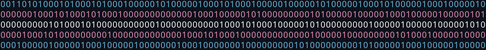
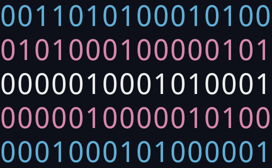

# transprimes.bash

A bash script that prints a trans flag made of binary-coded primes.

#### What?

Each digit represents an integer (starting from zero). If that number is a prime, the digit is a `1`, else the digit is a `0`.

## Potential uses

- Pretty!
- Pridey!
- Nerdy!
- If you make your terminal window the right width (a multiple of 6 for example), you can see some prime patterns.

## Pictures

Works for variable window dimensions (although it will take longer):

